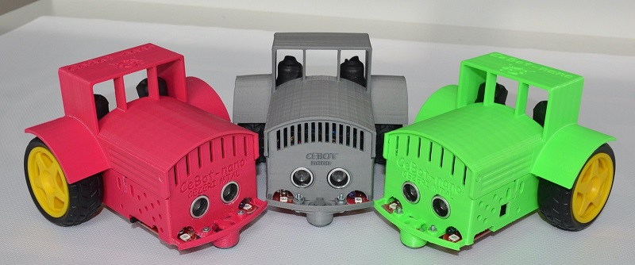

# CeBot-Nano
---

## Gelişim Tablosu:
- 22.10.2019 Elektronik öğretmenimiz Mustafa KARAKAŞ tarafından hazırlanan uygulama notları eklendi.
- 22.10.2019 ebook klasörü oluşturuldu. (Bu klasörde yazarlarımız tarafından hazırlanmış CeBot-nano materyalleri paylaşılacaktır.)
- 22.10.2019 CeBot-nano montaj videosu youtube üzerinde paylaşıldı.
- 21.10.2019 CeBot-nano projemize ait dosyalar github üzerinde paylaşılmaya başlandı.
- 18.10.2019 İlk grup CeBot-nano üretimi tamamlandı ve CeBot projelerine katılan okullarımıza ulaştırıldı.

## Sponsorlar:
- Robolink Teknoloji:
## Satış kanalları:

[Cezeri Yeşil Teknoloji MTAL Döner Sermaye İşletmesi]: http://cezeri.meb.k12.tr "title"

[Cezeri Yeşil Teknoloji MTAL Döner Sermaye İşletmesi]

